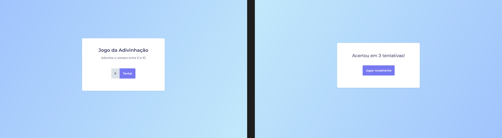

<h1 align="center"> Jogo da Adivinhação 👀</h1>

Jogo da Adivinhação

  <a href="#-tecnologias">Tecnologias</a>&nbsp;&nbsp;&nbsp;|&nbsp;&nbsp;&nbsp;
  <a href="#-projeto">Projeto</a>&nbsp;&nbsp;&nbsp;
  

 

  

## 🚀 Tecnologias

Esse projeto foi desenvolvido com as seguintes tecnologias:

- HTML, CSS e JavaScript
- Git e Github
- Figma

## 💻 Projeto

A página de Título: Jogo da adivinhação foi realizada no Stage 5 do módulo Explorer da Rocketseat. Iniciamos integração da página com o JavaScript. 

- [Acesse o projeto finalizado, online](https://viniciuszmota.github.io/Jogo-da-Adivinha-o/)

---

Feito com ♥ by Vinicius Zamprogno Mota, estudante na Rocketseat 👋
